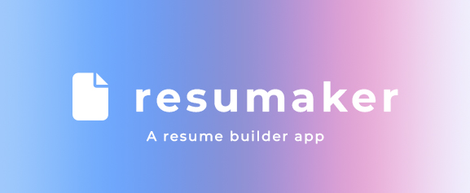
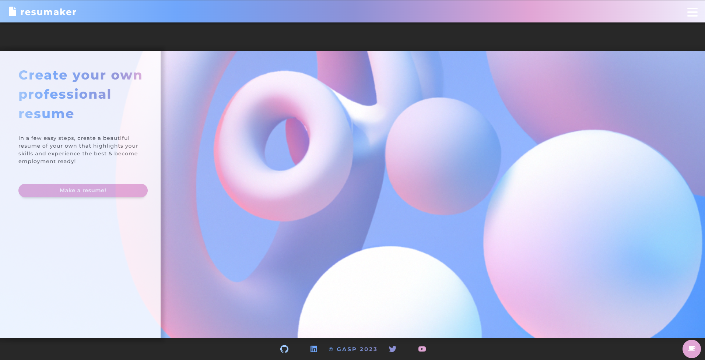
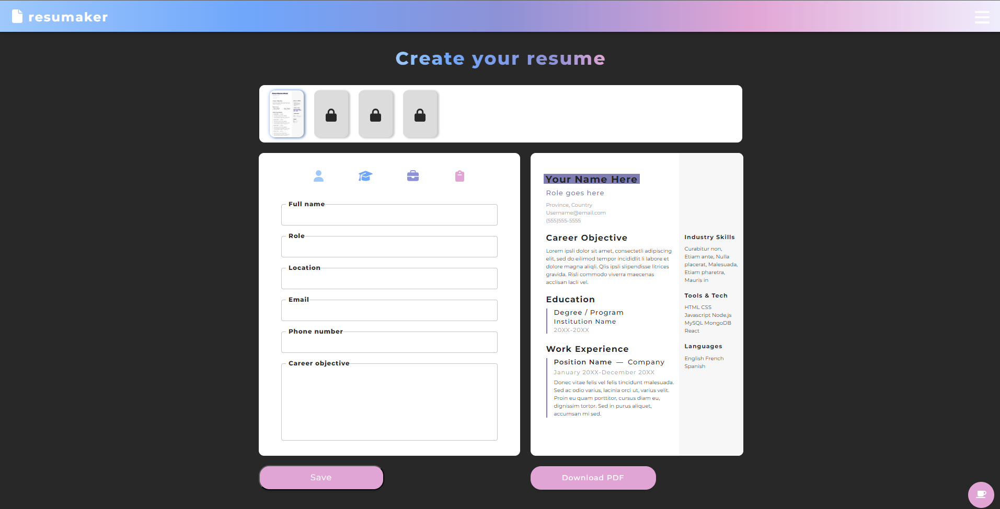

# Resumaker

  
  

  
<p align="center">

</p>

## Description

As Bootcamp Students, we wanted to create an app that allows users to create free resumes! Trying to get a job is one challenge but 
having to pay money just to create a resume is NOT COOL! This became our motivation for the project. We want to allow our users to 
create a FREE account and not have to enter any credit card details to use the application.

## Table of Contents

- [Demo](#demo)
- [Usage](#usage)
- [Screenshots](#screenshots)
- [Questions](#questions)

## Demo

Check out the site! -> https://intense-atoll-83101.herokuapp.com/ 

## Usage

Users can register for a free account with us and begin filling out the respective fields: Education, Skills, Work...etc. All the data
is saved on mongoDB Atlas which allows the fields to be populated on revist. The rendered resume is exported to PDF via a package ____

##### Prerequisites

- Install NodeJs and npm https://nodejs.org/en/download/
- Install MongoDB compass

##### Installation

- Clone our repository
  ```sh
  git clone git@github.com:Sophack/resumaker.git
  ```
- Install dependencies
  ```sh
  npm i
  ```
- Start the app locally:
  ```sh
    npm run developp
  ```

## Screenshots





## Questions

Philip V K
email: philipkurianv@gmail.com
github: https://github.com/PhilipVKurian

Sophack
email:
github: https://github.com/Sophack

Kirbyfridge
email:
github: https://github.com/kirbyfridge

godwingi
email: 
github: https://github.com/godwingi


<!-- Links -->


